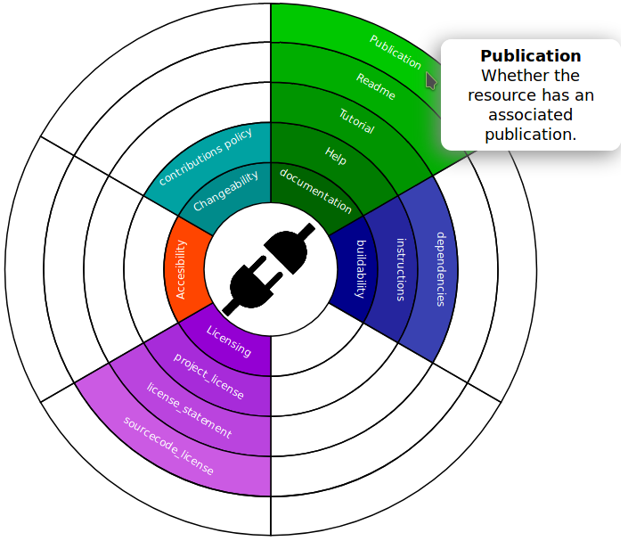
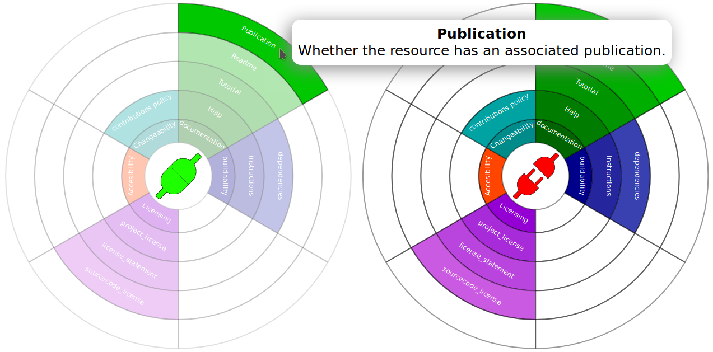
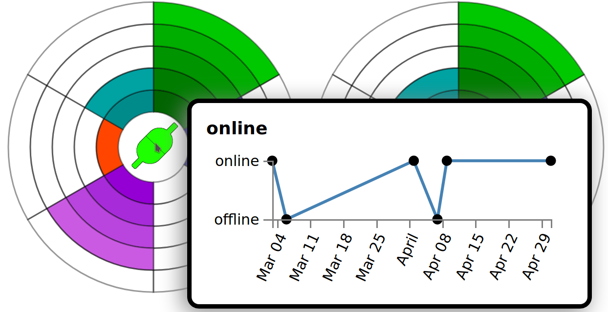
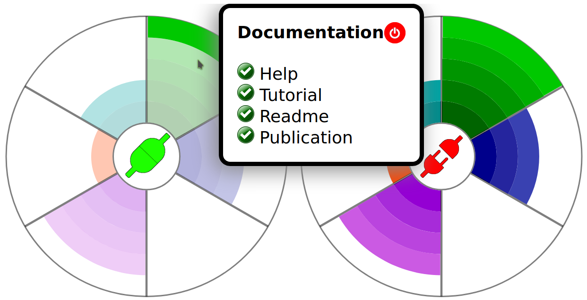
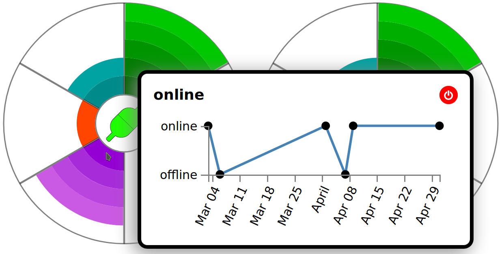
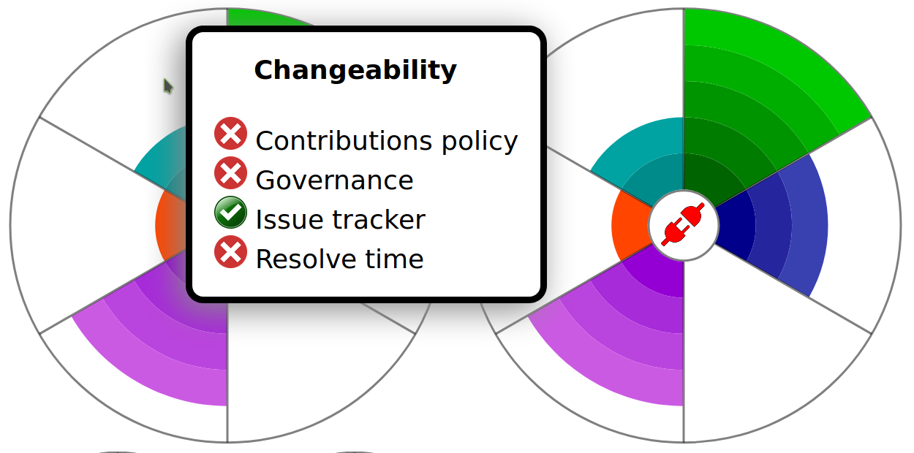
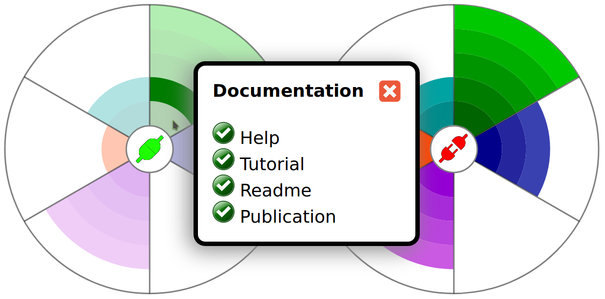

# <https://dev-openebench.bsc.es/widget/>

**Widget's mockup repository for OpenEBench**

- [Technologies](#technologies)
- [Iterations](#iterations)
  1. [Initial mockup](#initial-mockup)
  2. [Evolution I](#evolution-i)
  3. [Evolution II](#evolution-ii)
  4. [Evolution III](#evolution-iii)
  5. [Evolution IV](#evolution-iv)
  6. [Evolution V](#evolution-v)

## Technologies
Only [d3.js](https://d3js.org/) is used to draw all iterations

## Iterations
### Initial mockup
- First idea

### Evolution I
- Tooltips highlighted on hovering
- Colored plug-in icons

### Evolution II
- Categories summary with tick icons
- Online/Offline uptime plot inside the plug-in tooltip icon
- 200x200, 100x100, 75x75 sizes

### Evolution III
- All arcs now show the metrics summary
- Hide arc stroke lines
- Add mouse click event (and a exit button) to fix the tooltips in the screen

### Evolution IV
- Library isolation
- Customizable widget size
- Fix load html without iframe behaviour
- Fix mime types in Ipad devices
- Improved click behaviour
- Added tooltip information to the empty widget parts
- All data in one JSON

### Evolution V
- Added package.json management with development and production deployments
- Refactored d3 to import only used submodules (30 -> 7)
- Webpack
  - Minified javascript with uglifyjs
  - Minified icons with pngquant
  - All files packaged in one js

_No screenshot, only internal changes_
