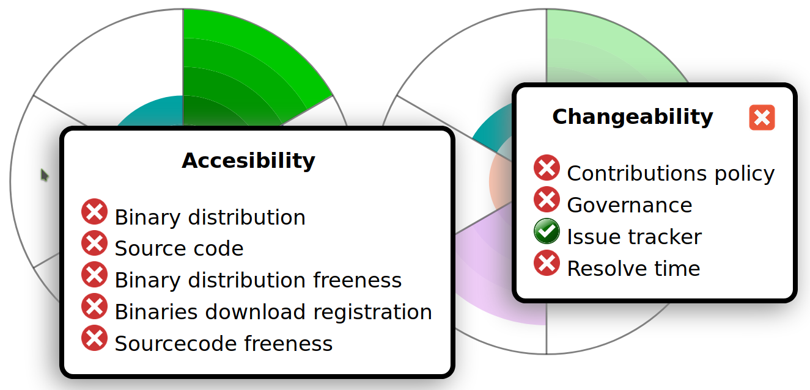

# Evolution V
## Changelog
- Added package.json
  - Scripts section
    - dev: development deployment
    - dist: distribution deployment
    - lint: linter javascript code
- Refactored d3.js to import only used submodules (30 -> 7 modules)
- Webpack (all javacripts, css and images bundled in one js)
  - dev (without minified): 1.5MB
  - dist(with minified) 216KB
- Better icons names

## Instructions to build the widget's development version
```
yarn install
yarn dev
```

## Instructions to build the widget's distribution version
```
yarn install
yarn dist
```


