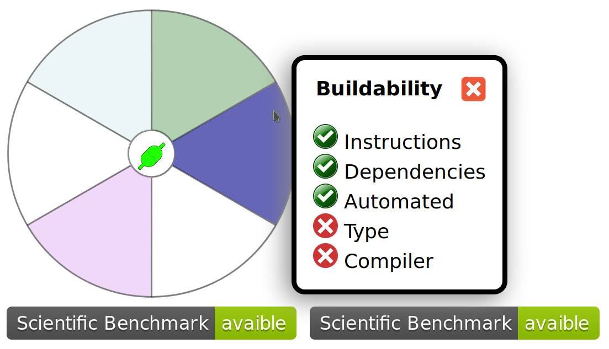

# Evolution VI mockup
## Changelog
- Added template widget model
  - Added new demo widget
    - One arc per metric
    - Color gradient according to the number of submetrics
- Cleaned script section of package.json

## Instructions to build the widget's development version
```
yarn install
yarn dev
```

## Instructions to build the widget's distribution version
```
yarn install
yarn dist
```

# Screenshot

